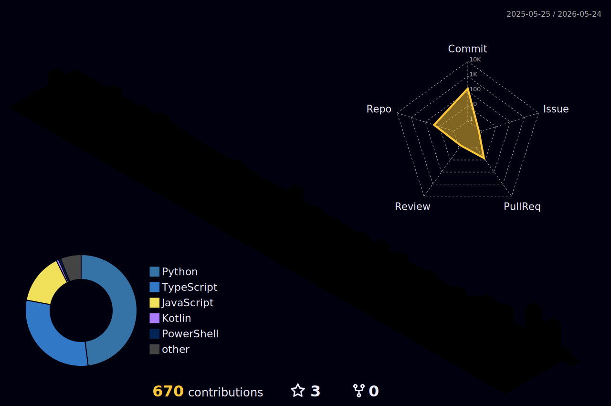

<p align="center">
  
</p>

<p align="center">
  <a href="https://api.visitorbadge.io/api/visitors?user=hk4crprasad&repo=hk4crprasad&label=VISITORS&labelColor=%230d1117&countColor=%23818cf8&style=for-the-badge">
    
  </a>
  &nbsp;
  
  &nbsp;
  
</p>

<br/>


## 🧑‍💻 &nbsp;About Me

```python
class Haraprasad:
    def __init__(self):
        self.name        = "Haraprasad Hota"
        self.username    = "hk4crprasad"
        self.location    = "Puri, Odisha, India 🇮🇳"
        self.company     = "@CYNERZA"
        self.education   = "IMIT"
        self.role        = "Python Developer & AI Agent Builder"
        self.year        = 2026

    @property
    def stack(self):
        return {
            "languages"  : ["Python 🐍", "TypeScript", "JavaScript", "C/C++"],
            "ai & bots"  : ["LLM Pipelines", "AI Agents", "Telegram Bots", "Discord Bots"],
            "cloud"      : ["AWS", "Azure", "Docker", "Linux"],
            "databases"  : ["MongoDB", "MySQL"],
        }

    @property
    def currently(self):
        return {
            "🔭 building"  : ["EmotiCare", "Cyne-AI", "WP-BOT"],
            "🌱 learning"  : ["Agentic AI", "RAG Pipelines", "Multi-modal LLMs"],
            "💡 obsessed"  : "Making bots that feel human",
        }

    def fun_fact(self):
        return "I think I can solve ALL problems. ⚡"

me = Haraprasad()
print(me.fun_fact())
# >>> I think I can solve ALL problems. ⚡
```


## ⚡ &nbsp;Tech Stack

<div align="center">

**Languages**

<a href="https://skillicons.dev">
  
</a>

<br/>

**AI · Bots · Frameworks**

<a href="https://skillicons.dev">
  
</a>
&nbsp;

&nbsp;

&nbsp;


<br/>

**Cloud · DevOps**

<a href="https://skillicons.dev">
  
</a>

<br/>

**Databases · Tools**

<a href="https://skillicons.dev">
  
</a>

</div>


## 🏆 &nbsp;Trophies

<div align="center">
  
</div>


## 📊 &nbsp;GitHub Stats

<div align="center">
  <table border="0" cellspacing="0" cellpadding="8">
    <tr>
      <td align="center">
        
      </td>
      <td align="center">
        
      </td>
    </tr>
    <tr>
      <td colspan="2" align="center">
        
      </td>
    </tr>
  </table>
</div>


## 🌌 &nbsp;3D Contribution Galaxy

<div align="center">
  
</div>


## 🐍 &nbsp;Contribution Snake

<div align="center">
  <picture>
    <source media="(prefers-color-scheme: dark)" srcset="https://raw.githubusercontent.com/hk4crprasad/hk4crprasad/output/github-contribution-grid-snake-dark.svg" />
    <source media="(prefers-color-scheme: light)" srcset="https://raw.githubusercontent.com/hk4crprasad/hk4crprasad/output/github-contribution-grid-snake.svg" />
    
  </picture>
</div>


## 📈 &nbsp;Activity


## 🚀 &nbsp;Projects

<div align="center">
  <a href="https://github.com/hk4crprasad/EmotiCare">
    
  </a>
  <a href="https://github.com/hk4crprasad/Cyne-Ai">
    
  </a>
  <a href="https://github.com/hk4crprasad/Medical_Chat_Assistant">
    
  </a>
  <a href="https://github.com/hk4crprasad/LearnSync">
    
  </a>
</div>


## 🤝 &nbsp;Connect

<div align="center">
  <a href="mailto:haraprasadhota1@gmail.com">
    
  </a>
  &nbsp;
  <a href="https://twitter.com/haraprasad_2005" target="_blank">
    
  </a>
  &nbsp;
  <a href="https://instagram.com/hk4crprasads" target="_blank">
    
  </a>
  &nbsp;
  <a href="https://github.com/hk4crprasad" target="_blank">
    
  </a>
</div>

<br/>


<div align="center">
  
</div>

<br/>

<div align="center">
  
</div>

<br/>


